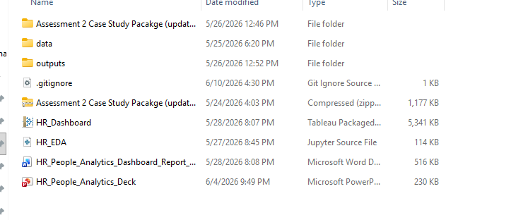

# HR People Analytics Dashboard

An interactive HR analytics dashboard built to help HR managers, workforce planners, diversity and inclusion teams, and senior leaders monitor workforce risk, identify priority areas, and support evidence-based people decisions.

The dashboard consolidates employee-level data into one executive view covering attrition, workforce composition, career mobility, pay equity indicators, training, absence, satisfaction, and workforce experience.



---

## Project Overview

People-related risks are often tracked across separate HR reports, making it difficult for decision-makers to understand how attrition, demographics, salary distribution, training, absence, and employee satisfaction are connected.

This project addresses that problem by developing a Tableau dashboard that turns fragmented HR data into a clear workforce monitoring and decision-support tool.

The dashboard is designed to answer three key business questions:

1. Where is workforce risk concentrated?
2. Which workforce factors may explain attrition or disengagement?
3. What actions should HR leaders prioritise based on the evidence?

---

## Key Dashboard Metrics

| Metric | Value |
|---|---:|
| Total Attritions | 405 |
| Attrition Rate | 23% |
| Active Employees | 1,380 |
| Average Satisfaction | 3.16 / 4.0 |

---

## Tools and Technologies

- Tableau for dashboard design and interactive visualisation
- Python for data cleaning and exploratory data analysis
- Excel for data review and preparation
- Dashboard filters for Department, Job Role, Gender, and Age Band
- Calculated fields for attrition rate, active employees, salary bands, career bands, and satisfaction measures

---

## Dataset Coverage

The dashboard uses HR workforce data covering:

- Employee status
- Department
- Job role
- Job level
- Hire year
- Age band
- Gender
- ATSI identification
- Education level
- Salary band
- Training sessions
- Absence days
- Years at company
- Years in current role
- Years since last promotion
- Years with current manager
- Satisfaction and people experience scores

---

## Dashboard Sections

### 1. Executive KPI Summary

The dashboard begins with key workforce indicators, including total attrition, attrition rate, active employees, average satisfaction, and hiring trend. This gives senior leaders a fast view of overall workforce health.

### 2. Workforce Composition

The demographic section visualises age distribution, gender distribution, ATSI identification, education level, department mix, and role-level patterns. This helps leaders understand the structure of the workforce before interpreting salary, promotion, or satisfaction outcomes.

### 3. Attrition and Role Risk

The dashboard highlights attrition as a material and role-specific issue. Roles such as Solutions Architect and Sales Representative show higher attrition risk, suggesting that retention action should be targeted rather than generic.

### 4. Career Mobility

A career heatmap combines years at company, years in current role, years since last promotion, and years with current manager. This helps identify possible career stagnation and internal mobility risk.

### 5. Salary and Job Level

Salary distribution is shown by gender alongside job level distribution. These visuals are used as a pay equity screening tool, not a final conclusion. Further controlled analysis by role, level, tenure, and performance would be required before making equity claims.

### 6. Training, Absence, and People Experience

The dashboard tracks training session participation, absence day bands, and satisfaction-related indicators such as development, inclusion, job satisfaction, performance, SDG score, wellbeing, and work-life balance.

---

## Key Insights

### Insight 1: Attrition risk is material and role-specific

The dashboard reports 405 total attritions and a 23% attrition rate. This suggests attrition is a significant workforce risk. Role-level analysis shows that turnover is not evenly distributed, so targeted retention strategies are more appropriate than broad HR initiatives.

### Insight 2: Gender imbalance affects interpretation of equity indicators

The workforce is approximately 78% male and 22% female. This does not prove inequity by itself, but it affects how salary, job level, and satisfaction outcomes should be interpreted. Controlled analysis is needed before drawing conclusions about pay or progression equity.

### Insight 3: Career mobility should be monitored as a retention driver

The career heatmap shows that career progression risk is multidimensional. Long tenure, long time in current role, and delayed promotion may increase disengagement risk if not monitored regularly.

### Insight 4: Salary distribution requires deeper pay equity analysis

Salary by gender and job level visuals provide an initial screening view. However, salary patterns may be influenced by role mix, tenure, job level, and performance. A controlled pay equity audit would be required for deeper analysis.

### Insight 5: Training participation is strong, but impact is unclear

A large share of employees attended multiple training sessions, but training volume does not automatically prove improved capability or career progression. Training should be linked to promotion readiness, satisfaction, and job movement.

### Insight 6: People experience is moderate-to-positive, not uniformly high

People experience scores cluster around 3/5 and 4/5. This suggests the workforce is not experiencing severe dissatisfaction overall, but several indicators should be monitored as early warning signals for attrition.

---

## Recommendations

### 1. Implement role-specific retention plans

Focus on high-risk roles with stronger attrition patterns. Recommended actions include exit interviews, workload reviews, salary benchmarking, promotion pathway reviews, and manager stay conversations.

### 2. Run a controlled pay equity audit

Analyse salary outcomes by gender while controlling for job level, role, tenure, and performance. This would provide a more reliable view of whether pay inequity exists.

### 3. Connect training to career progression metrics

Track whether employees who attend more training sessions experience promotion, internal mobility, or improved satisfaction over time.

### 4. Launch a quarterly people experience review

Review satisfaction, wellbeing, absence, and attrition together every quarter to identify early warning signals before they become larger workforce risks.

---

## Visualisation Design Approach

The dashboard uses a top-down executive layout:

1. KPI summary
2. Hiring and attrition indicators
3. Workforce composition
4. Career mobility
5. Salary and job level
6. Training, absence, and satisfaction indicators

The design uses a consistent mauve, plum, and light-grey colour palette. Mauve represents the active contribution or selected value, grey provides background comparison, and darker plum highlights higher concentration in heatmaps.

The dashboard includes interactive filters for:

- Department
- Job Role
- Gender
- Age Band

---

## Repository Structure

```text
.
├── data/
│   └── Raw and cleaned HR datasets
├── outputs/
│   └── Dashboard outputs and supporting visual files
├── HR_EDA.ipynb
│   └── Python notebook for data cleaning and exploratory analysis
├── HR_Dashboard.twbx
│   └── Tableau packaged workbook
├── HR_Dashboard.png
│   └── Full dashboard screenshot
├── HR_People_Analytics_Dashboard_Report.docx
│   └── Written report explaining business problem, insights, and recommendations
├── HR_People_Analytics_Deck.pptx
│   └── Presentation deck summarising dashboard insights
└── README.md
```

---

## Business Value

This dashboard helps HR leaders move from static reporting to evidence-based workforce decision-making. It provides a structured way to identify where people risks are concentrated, understand which workforce groups may need attention, and prioritise actions using dashboard evidence.

The project demonstrates skills in:

- Business problem framing
- HR analytics
- Data cleaning and preparation
- KPI dashboarding
- Tableau visualisation
- Insight communication
- Workforce risk analysis
- Evidence-based recommendations

---

## Project Status

Completed as an academic analytics and dashboarding project for Visualising and Communicating Insights in Business.

---

## Author

Khoa Nguyen  
Master of Business Information Technology  
RMIT University
